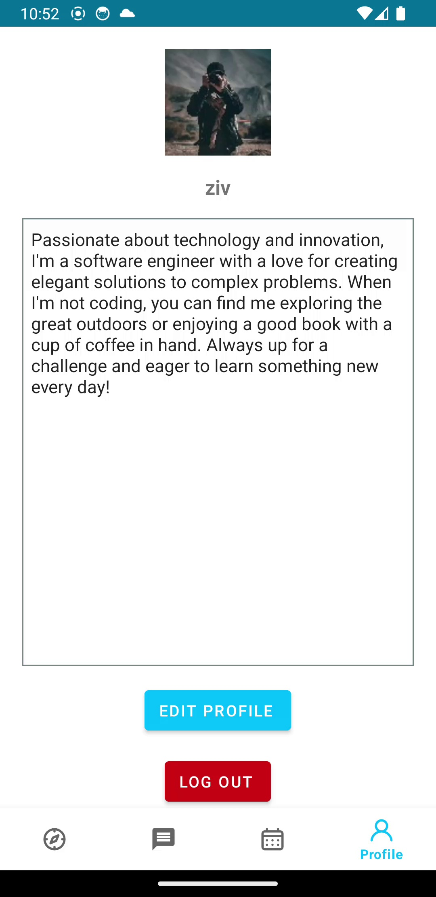
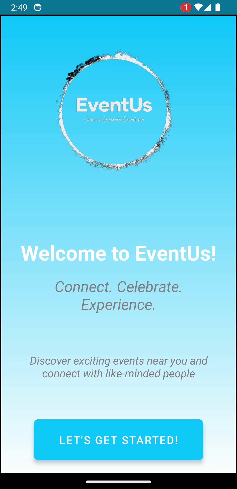
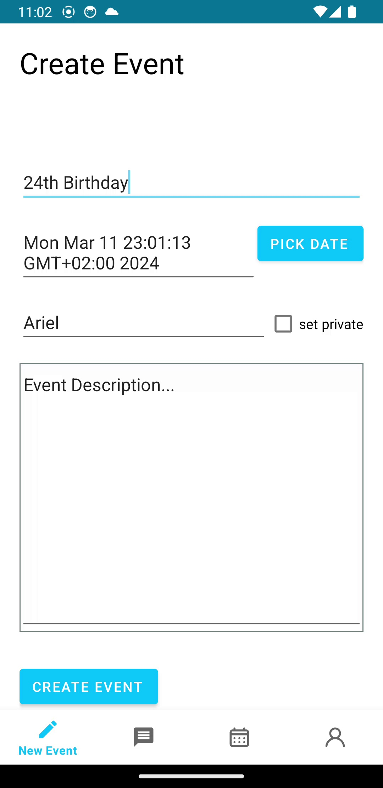
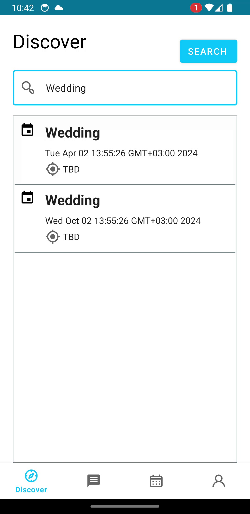

# 🎉 EventUs 📅

[](LICENSE)

Welcome to EventUs, your ultimate event management companion! 🚀 Whether you're an event organizer or a participant, EventUs provides you with the tools you need to plan, manage, and enjoy events seamlessly. Let's make every event an unforgettable experience! 💫

## ✨ Features

- **User-Friendly Interface**: Enjoy a seamless user experience with an intuitive interface designed to enhance usability and navigation.
- **Event Discovery**: Easily discover a wide range of events tailored to your interests and preferences.
- **Event Creation**: Effortlessly create and customize events with detailed information, including dates, locations, descriptions, and more.
- **Participant Management**: Efficiently manage participants, invitations, and RSVPs for your events.
- **Real-Time Communication**: Stay connected with event participants through real-time messaging and updates.
- **Profile Customization**: Personalize your profile with photos, bios, and preferences to enhance your event experience.
- **Comprehensive Analytics**: Gain insights into event attendance, engagement, and feedback through comprehensive analytics and reporting tools.

## 📸 Screenshots






## 🚀 Getting Started

To get started with EventUs, follow these steps:

1. **Clone the Repository**:
   ```bash
   git clone https://github.com/GalHillel/EventUs.git
   ```

2. **Set Up the Backend**:
   - Navigate to the `backend/event-us` directory.
   - Follow the instructions in the backend README to set up and run the backend server.

3. **Set Up the Frontend**:
   - Navigate to the `frontend/app` directory.
   - Follow the instructions in the frontend README to set up and run the Android application.

4. **Explore and Enjoy**:
   - Launch the EventUs application on your device.
   - Discover, create, and participate in exciting events!

## 🤝 Contributing

We welcome contributions from the community to enhance EventUs further. To contribute, please follow these guidelines:

1. Fork the repository and create your branch (`git checkout -b feature/YourFeature`).
2. Commit your changes (`git commit -am 'Add new feature'`).
3. Push to the branch (`git push origin feature/YourFeature`).
4. Create a new Pull Request.

## 📝 License

This project is licensed under the MIT License - see the [LICENSE](LICENSE) file for details.

## 📬 Contact

For any inquiries or feedback, please contact us at [galh2011@gmail.com](mailto:galh2011@gmail.com).
